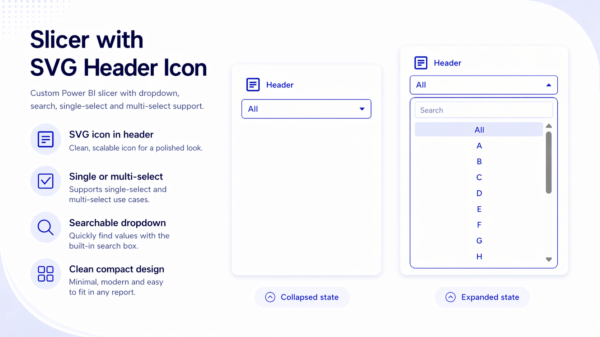

# Slicer with SVG Header Icon

This repo contains a Power BI custom visual that behaves like a slicer, but with a header area you can style more freely than the built-in slicer. The main use case is simple: show an SVG icon in the header, control its colours, and keep the slicer looking like part of the report instead of a stock visual.

[ready-to-use release](https://github.com/ShuiGuiPoppy/Slicer-with-SVG-Header-Icon/releases/tag/v1.0.0.0)



## Why this exists

I built this just because I wanted to add a simple SVG icon beside the slicer header. 

## What it does

- Shows a compact slicer header with an SVG icon
- Lets report authors paste custom SVG markup
- Supports separate line and fill colours for the icon
- Exposes header, border, text, and dropdown styling in the format pane
- Supports search, sorting, single-select, and multi-select
- Uses the current Power BI formatting model

## Main files

- `pbiviz.json` for visual metadata and packaging
- `capabilities.json` for data roles and format pane properties
- `src/visual.ts` for rendering and interaction logic
- `src/settings.ts` for formatting model definitions
- `style/visual.less` for layout and styling

## Local development

Install dependencies:

```powershell
npm install
```

Run the visual in development mode:

```powershell
pbiviz start
```

Package the visual for import into Power BI:

```powershell
pbiviz package
```

The generated `.pbiviz` file is written to `dist\`.

For Power BI custom visual environment setup, see [Microsoft Learn: Set up your environment for developing a Power BI visual](https://learn.microsoft.com/en-us/power-bi/developer/visuals/environment-setup).

## Import into Power BI Desktop

1. Run `pbiviz package`.
2. Open Power BI Desktop.
3. In the Visualizations pane, choose `Import a visual from a file`.
4. Select the `.pbiviz` file from `dist\`.

## Download release build

If you just want the ready-to-use visual, download the `.pbiviz` file from the repo's GitHub Releases page and import it into Power BI Desktop without building the project locally.

## Format pane areas

- Header: title, title visibility, placeholder, colours, title font, value font
- Icon: show/hide, SVG markup, line colour, fill colour, size
- Border & Layout: card background, border colour, border radius, padding
- Items: font, alignment, row styling, hover, selected state, search, sizing
- Selection: single-select or multi-select
- Sort: ascending or descending
